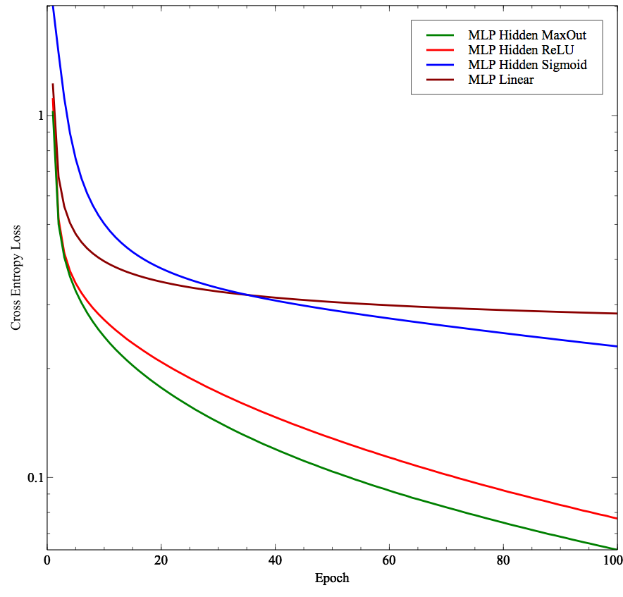

# Maxout Networks (Ian Goodfellow, Yoshua Bengio - 2013)
Maxout Networks TensorFlow implementation presented in https://arxiv.org/abs/1302.4389

## How to run the MNIST experiment?

```bash
# make sure Tensorflow is installed.
git clone git@github.com:philipperemy/tensorflow-maxout.git maxout && cd maxout
python mnist_maxout_example.py MAXOUT # Can pick up from one of those values: LINEAR, RELU, MAXOUT.
```

## How to integrate it in your code

It's two lines of code. Sorry I can't make it shorter.

```python
from maxout import max_out
y = tf.matmul(x, W1) + b1
t = max_out(y, num_units=50)
```

# Some Results on MNIST dataset

Those results are not meant to reproduce the results of the paper. It's more about showing on how to use the maxout non linearity in the Tensorflow graphs.

## Loss

As expected, Maxout strictly outperforms Sigmoid and ReLU. Having one hidden layer + non linearity helps to have a smaller loss.

<div align="center">
  <br><br>
</div>

## Accuracy

| Model      | Accuracy (100 epochs) | 
| ------------- |:-------------:|
| MLP Hidden MaxOut      | 0.9730 |
| MLP Hidden ReLU       |  0.9704      |
| MLP Hidden Sigmoid | 0.9353      |
| MLP Linear | 0.9214      |
